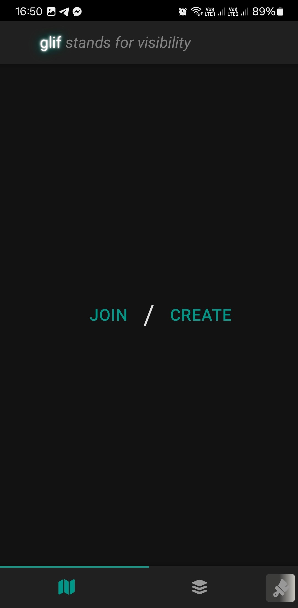
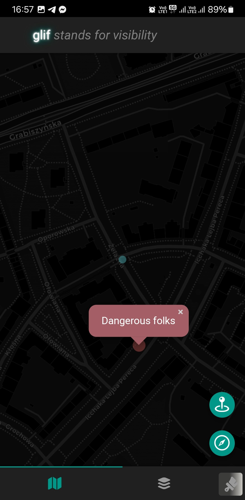
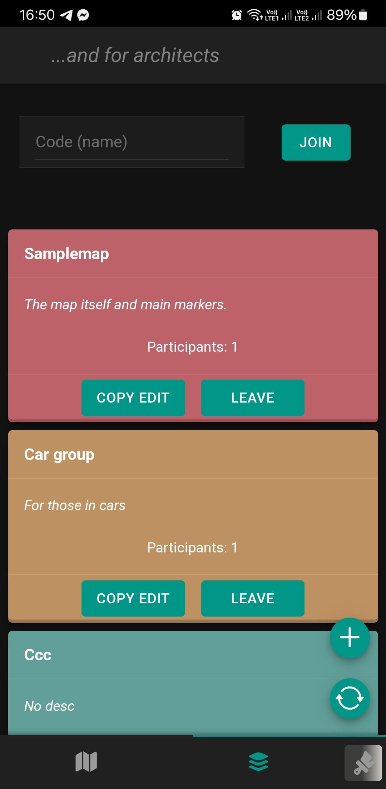

<!-- README.md is generated from README.Rmd. Please edit that file -->

# glif

<!-- badges: start -->

[](https://CRAN.R-project.org/package=glif)
[](https://lifecycle.r-lib.org/articles/stages.html#experimental)

<!-- badges: end -->

`{glif}` is a mobile, PWA compatible, shiny app (i.e. developed using
mainly `{shiny}` and `{shinyMobile}`) to create maps, groups (layers)
and put markers to be visible by others belonging to the same map and
groups. It was inspired by the protests taking place in Poland in
2020/2021 during which police and counter-activists used violence
against demonstrators. `{glif}` can be used to show danger places on the
map.

`{glif}` as a word comes from Polish and means form of window frame used
in medieval architecture to lightning of the interior.

## Installation

You can install the development version of `{glif}` from
[GitHub](https://github.com/) with:

``` r
# install.packages("devtools")
devtools::install_github("gsmolinski/glif")
```

Please note that current version of `{glif}` expects PostgreSQL (can be
changed to other driver with code adjusted) with fixed schema. Details
about this can be found in directory `./inst/database/` where is script
to create tables as well as YAML config file.

## App example

Deployed app is accessible using following link:
[glif-app-online](https://gsmolinski.shinyapps.io/glif/).

|                  |                  |                  |
|:----------------:|:----------------:|:----------------:|
|  |  |  |

## Functionality

### Map

App consist of two tabs. On first is a map (user can join to specific
map knowing map name or create its own map), location button and - if
user belongs to any layer for which has edit privileges - button to set
marker on the place where user is currently. Location button works as a
refresh button as well - app do not automatically refresh user’s
position or marker (the only exception is when user sets the marker -
then all markers and position is refreshed).

### Layers

On the second tab are layers. These are groups (each one is open to join
for everyone) created by other users. User who created group has edit
privileges - this makes possible to put markers on the map which will be
visible to all users who joined or will join to this group. Any user can
have edit privileges for any group if is able to provide edit code.
Visible markers are from all groups to which user belongs and if user
puts the marker, it will be put for all groups for which user has edit
privileges.
